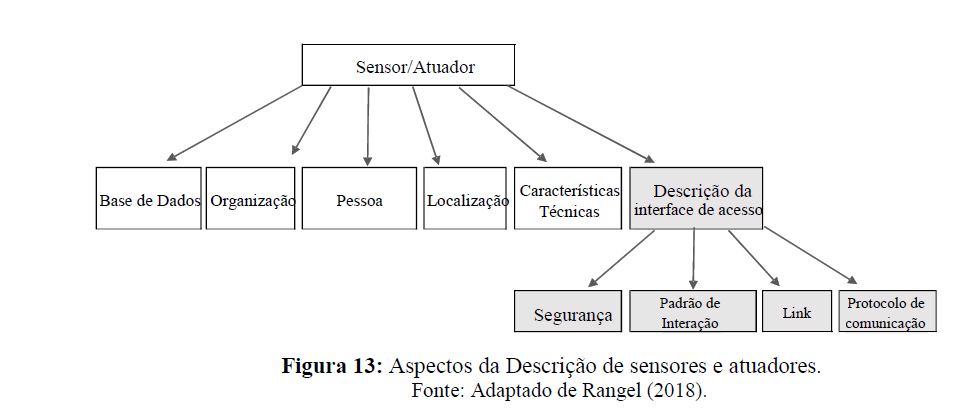
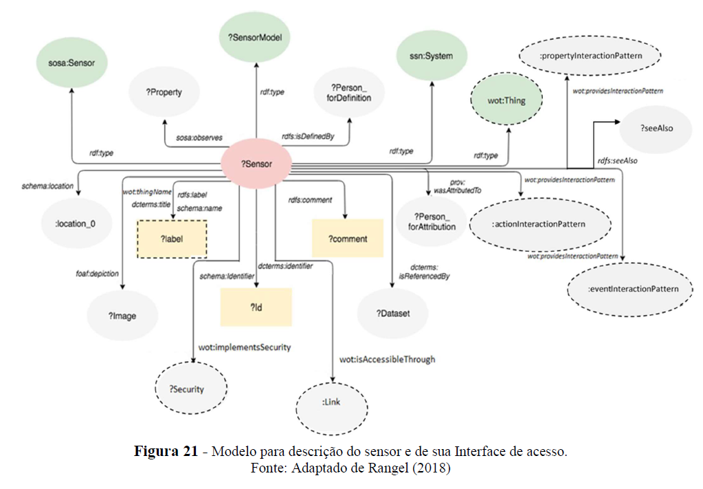
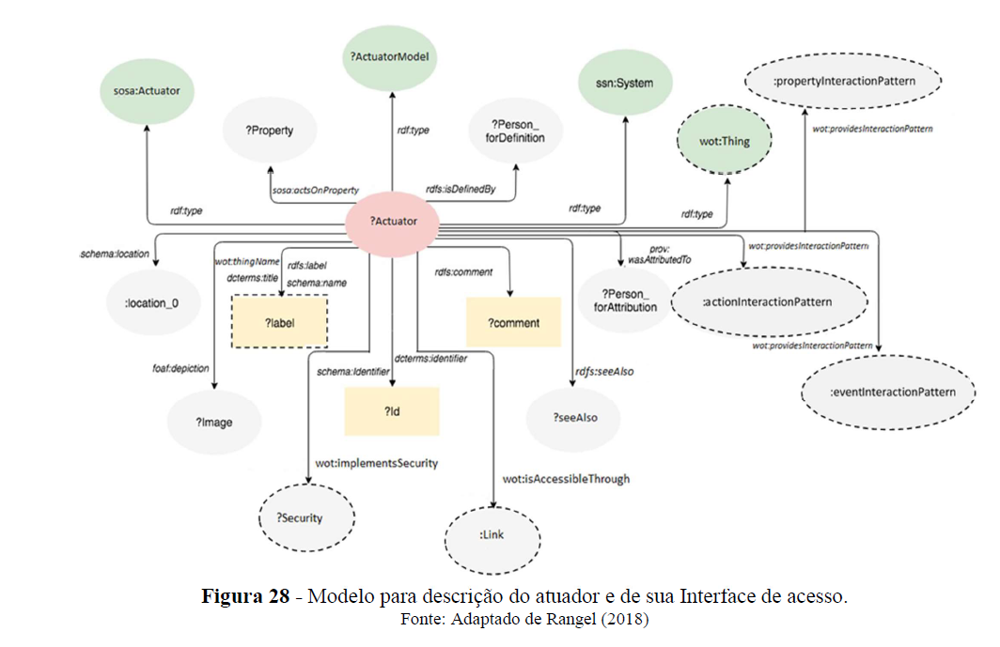

# Semantic Representation of Sensor and Actuator Access Interfaces

**Master's Research Project — 2019**

Semantic Web • Linked Data • Ontologies • Web of Things (WoT) • Internet of Things (IoT)

## About the project

This repository contains the implementation developed as part of my Master's research on the **formal semantic representation of access interfaces for sensors and actuators**.

The research investigated how Semantic Web and Linked Data technologies can be used to formally describe not only the technical characteristics of smart devices, but also **how sensors and actuators can be accessed and used by software agents**.

The proposed approach integrates established ontologies and semantic vocabularies to represent aspects such as communication protocols, security mechanisms, interaction patterns, access links, and device characteristics.

A semantic Linked Data application was implemented using the **Callimachus framework**, with RDF/RDFa representations, SPARQL queries, JavaScript, and Web-based CRUD interfaces.

## Research context

This Master's research represents the second stage of a research line initiated by Rangel (2018) on the semantic description and cataloging of sensors and actuators using Semantic Web and Linked Data technologies.

Rangel's work established the first stage of the research, addressing the semantic cataloging of sensors, actuators, and related resources. The formal semantic description of how these devices could be accessed and used was explicitly identified as outside the scope of that work and proposed as a next step.

This research addressed that next stage by focusing on the **formal semantic description of sensor and actuator access interfaces**.

Building upon the conceptual and ontological foundation established in the previous research, this work incorporated additional aspects required to describe device access and use, including:

- Security
- Communication protocols
- Interaction patterns
- Access links
- Data schemas
- Sensor access interfaces
- Actuator access interfaces

The application presented in this repository was implemented independently as part of this Master's research using the Callimachus framework.

### Research evolution

The diagram below illustrates the relationship between the previous research stage and the contribution of this work. The original semantic catalog already described sensors and actuators through aspects such as databases, organizations, people, locations, and technical characteristics.

This research complemented that description by introducing the **formal semantic representation of the access interface**, including security, interaction patterns, links, and communication protocols.

*Figure — Aspects involved in the semantic description of sensors and actuators. The gray elements represent the additional aspects addressed in this research. Adapted from Rangel (2018).*

## Research contribution

The main contributions of this Master's research include:

- Definition of an ontological model for the **formal semantic description of sensor and actuator access interfaces**, complementing the semantic description established in the previous stage of the research.
- Identification and modeling of access-related aspects, including **security, communication protocols, interaction patterns, links, and data schemas**.
- Selection, reuse, and integration of established ontologies and semantic vocabularies to represent the concepts required by the proposed model.
- Semantic modeling of sensor and actuator access interfaces by combining concepts and relationships from different ontologies.
- Independent implementation of a **Linked Data semantic application** using the Callimachus framework to demonstrate the proposed model.
- Development of Web interfaces for creating, editing, and visualizing semantic descriptions of sensors, actuators, security mechanisms, communication protocols, and their access-related information.
- Use of RDF/RDFa and SPARQL to represent, store, query, and retrieve semantically structured information.
- Application and evaluation of the proposed approach through an IoT scenario.

## Semantic access-interface model

The proposed approach formally represents not only the technical and contextual characteristics of sensors and actuators, but also the information required to describe **how these devices can be accessed and used**.

### Sensor access-interface model

The sensor model combines the semantic description of the sensor with its access interface. It incorporates concepts from the previous research stage and integrates concepts from established ontologies and semantic vocabularies to represent the Thing Description (TD), interaction patterns, links, security mechanisms, communication protocols, and data schemas.

*Figure — Ontological model for the description of a sensor and its access interface. Adapted from Rangel (2018).*

### Actuator access-interface model

The actuator model follows the same semantic approach, combining the description of the actuator with the formal representation of its access interface. This enables actuators to be described not only by their technical characteristics and relationships, but also by the semantic information required for interaction and access.

*Figure — Ontological model for the description of an actuator and its access interface. Adapted from Rangel (2018).*

## Technologies and standards

The project combines Semantic Web, Linked Data, and Web technologies for the semantic representation and publication of sensor and actuator metadata and access interfaces.

### Semantic Web and Linked Data

- RDF (Resource Description Framework)
- RDFa
- RDFS
- OWL (Web Ontology Language)
- SPARQL
- Linked Data principles
- URIs for resource identification

### Ontologies and semantic vocabularies

The application reuses and integrates established ontologies and vocabularies, including:

- SOSA / SSN
- VICINITY Web of Things (WoT) Ontology
- Dublin Core Terms
- FOAF
- PROV-O
- Schema.org
- ORG
- vCard
- QUDT
- GoodRelations
- VoID

Reference ontology files used by the application are preserved in the repository as part of the original 2019 implementation.

### Application development

- Callimachus Linked Data framework
- HTML / XHTML
- RDFa
- JavaScript
- SPARQL queries
- Semantic CRUD interfaces

## Repository structure

This repository preserves the original development files from the Master's research, including intermediate versions created during the implementation process.

### Main research implementation

The most recent and complete version of the application is located in:

`Versão_Junho_WotDescription/ProjetoFinal-localhost/WoTDescription`

This directory contains the implementation corresponding to the final stage of the Master's research, including the semantic resources, Web interfaces, SPARQL queries, scripts, and ontology files used by the application.

### Historical development files

The repository also preserves earlier development versions:

- `Versão_Jan_WotDescription/` — earlier version of the application developed during the research.
- `New_Version_sensors-actuators-master/` — development artifacts preserved from the original research environment.

These directories are maintained for historical and research reproducibility purposes. The June version should be considered the primary implementation when exploring this repository.

> **Note:** The ontology and vocabulary files included in the project contain external semantic resources reused by the application. Their presence in this repository does not imply authorship of those ontologies.
